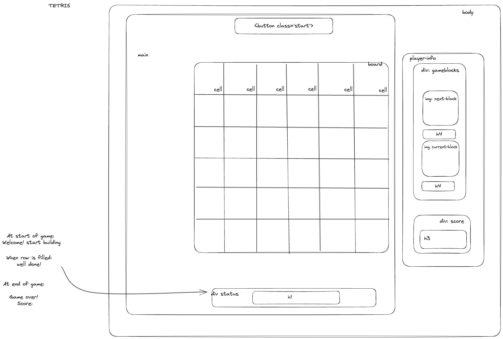
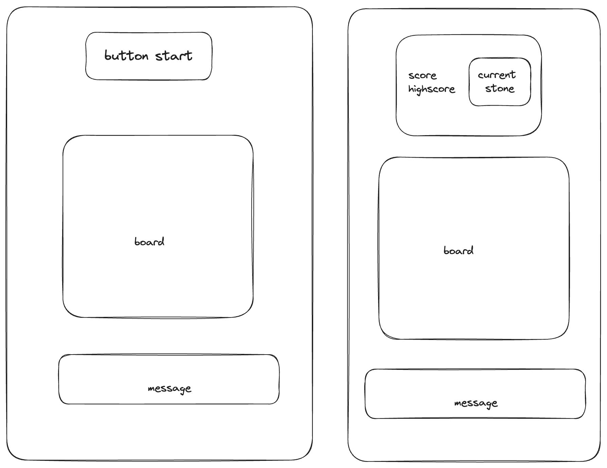
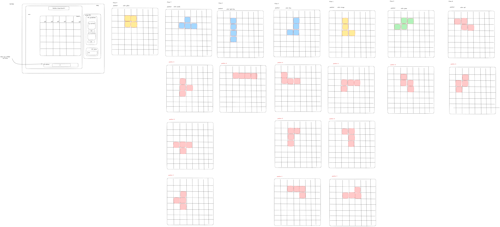

# Tetris game 

# Play my game: https://nlie2.github.io/Tetris/

Getting Started 

1. Fork and clone the repository
2. Open the page in default browser 

⚙️ Functionality \
    1. The player can rotate using the space bar, or tab on mobile version \
    2. Moving the stone left right, and down is done with the arrow controls\
    3. The game stops if a Tetrimino fills the highest row of the game board\
    4. The player can to rotate each Tetrimino about its own axis\
    5. If a line is completed it is removed and the pieces above take its place\

⚡️ Features \
    1. The player can see the next stone on the side of the grid \
    2. Multiple encouraging messages are displayed whenever the player scores points\
    3. The high score is saved if the browser is not refreshed \
    4. The user can change the theme of the site \
    5. Icon and title are displayed on top \
    6. The site is designed mobile up and can be played from your phone

⌨️ Implementation \
    1. I worked with objects to create the current stone and the next stone \
    2. I used Intervals and set time out to make the game flow consistently \
    3. I made the design mobile- up 

💪 What I am proud of \
    1. The rotations (they are different for all stones) - but once I figured out that adding stone is literally just adding a class to a cell it was alright \
    2. I worked with classes (It made working with everything a lot easier) \
    3. The most difficult part of this project was definitely reducing and updating the borders, and making the pile of stones fall down in the right way (I am still not 100% sure if it is working exactly as its supposed to) 

💥 Future improvements \
    1. Make turning possible on all borders \
    2. Try to make the dropping down of rows look more like a quick 'moving down' \
    3. Add a fun sound when the game starts, but give the player the option to not hear it. \
    4. Figure out if the compress pile function is working in the correct way (I am not sure if it does) \
    5. Make speed increase over time (could be done quite easily with an if statement) \
    6. Improve the mobile version \
        1. the start button and player info are not centered perfectly \
        2. Maybe make the buttons bigger to make the game nicer to play from phone 

# Wireframes
## Desktop

## Mobile

## Stones

